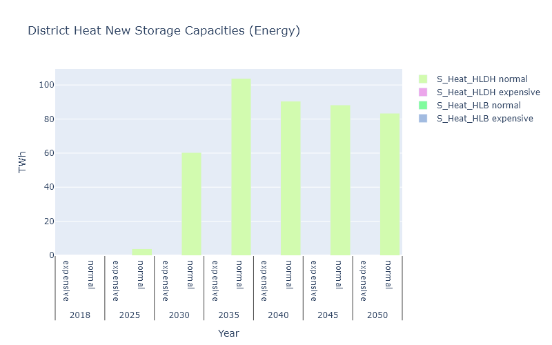
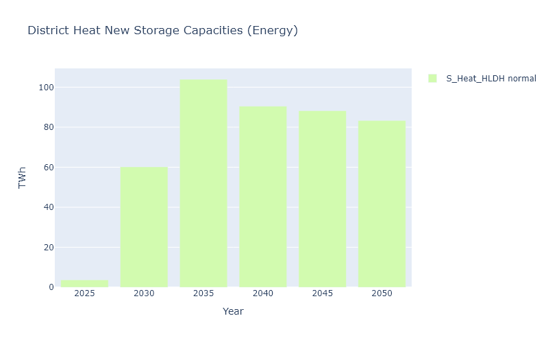
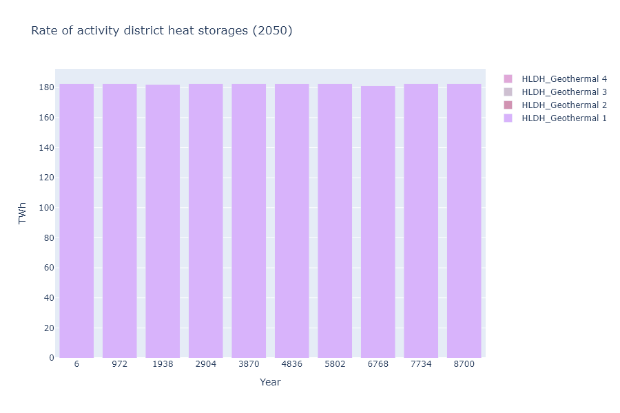
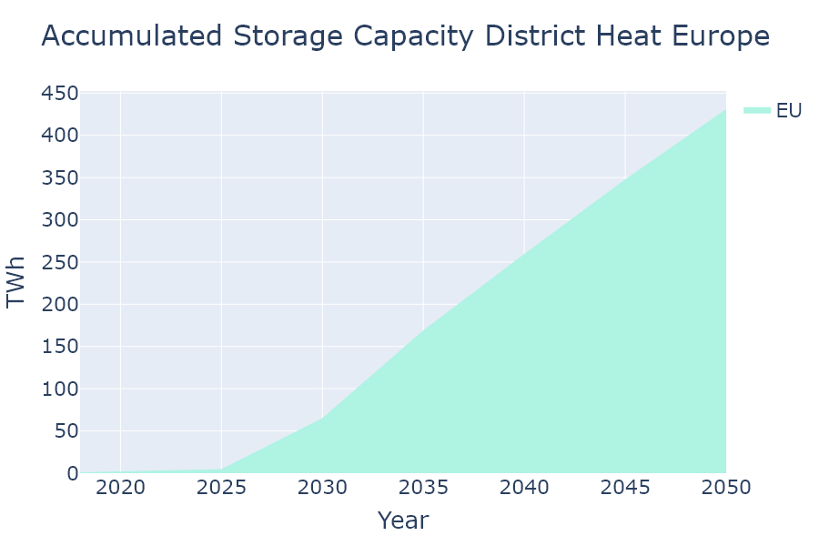

# Plotter for GENeSYS-MOD

## Installation

Recommended way to install is to use the provided `environment.yml` file to create a conda environment with all the necessary packages.

```bash
conda env create -f environment.yml
```

Then activate the environment:

```bash
conda activate genesys-mod-plotter
```

## Introduction

This repository aims to provide an easy framwork for creating plots for the GENeSYS-MOD model.
There are two challenging parts of making these plots; **reading data** and **putting the data into the plotting library in the right format**.
In an effort to remove the challenge of reading the data and putting it into the right format, this repository provides classes that does the heavy lifting, but allow you to do easy and usefull modifications to the data before plotting.

## How to use

The repository have ``Faciliator-classes`` that have the following methods:

- ``get_relevant_data(*some input args)``: This method reads the data from the GENeSYS-MOD output files.
    - This data can then be modified by the user. The only rule is for the data to be in the given format / structure.
- ``generate_traces(*data from above)``: This method generates the traces for the plotly library.
    - These traces can then be modified by the user if needed.
- ``get_figure(*traces from above)``: This method generates the figure for the plotly library.
    - This figure can then be shown or saved by the user. Or modified further.

## Examples

(See the ```./experiments/example_experiments.ipynb``` folder a working notebook with examples)

One of the supported plot types are **Bar**-plots. Here is an example of how to make a bar plot of installed storage capacities in Europe in 2050.

```python
PROJECT_ROOT_DIR = Path().__file__
SOLUTION_DIR = PROJECT_ROOT_DIR / "solution_files"

# First we define the path to two different runs that we want to compare
# These two runs will get their own label in an extra "Source" - column, afer reading the data
NORMAL_DATA = SOLUTION_DIR / "solution.sol"
```

- When initializing the **BarFaciliator** we can easily make groups along on the x-axis of the plot. For now we want bars for each year, and within each year we want bars for both solutions files (*normal* and *expensive*). To do this we set ```x_grouping_columns=['Year', 'Source']```.
- We can also set the how the groupings for the *legends* / *colors* should be. Should each **Storage**-type (in this case) have its own color, and maybe each **Source** should have its own color as well? We can achieve this by setting ```legend_grouping_columns=['Storage', 'Source']```. 

```python
# We initialize the bar facilitator with the paths to the two solutions and the type of data we want to read
bar = BarFacilitator(sol_paths={"normal": NORMAL_DATA, "expensive": EXPENSIVE_DH_DATA}, type_of_data_to_read="NewStorageCapacity", 
                     x_grouping_columns=["Year", "Source"], legend_grouping_columns=["Storage", "Source"])

# We get the data from the facilitator
data = bar.get_relevant_data()

# We can sum all regions in EU, for this there is a helper function that can be used
data.aggreagate_all_by_sum(column_to_aggregate="Region", aggregated_entry_name="ALL", column_to_sum="Value")

# We can look at only district heating and building heating by accessing the data.df (Althoug we also have a helper function for this)
data.df = data.df[data.df["Storage"].isin(["S_Heat_HLDH", "S_Heat_HLB"])]

# We generate traces and a figure
fig = bar.generate_figure(bar.generate_traces(data))

# We can update the layout of the figure
fig.update_layout(
    title="District Heat New Storage Capacities (Energy)",
    xaxis_title="Year",
    yaxis_title="TWh",
    width=800,
    height=500
)
fig.show()
```



As we see the **S_Heat_HLB** is very low. Let's see if we can change the plot a bit. We remove the **Source** grouping along the x-axis to get a stacked plot, and only include storages of more than 1 TWh.

```python
# We initialize the bar facilitator with the paths to the two solutions and the type of data we want to read
bar = BarFacilitator(sol_paths={"normal": NORMAL_DATA, "expensive": EXPENSIVE_DH_DATA}, type_of_data_to_read="NewStorageCapacity", 
                     x_grouping_columns=["Year"], legend_grouping_columns=["Storage", "Source"])

# We get the data from the facilitator
data = bar.get_relevant_data()

# We can sum all regions in EU, for this there is a helper function that can be used
data.aggreagate_all_by_sum(column_to_aggregate="Region", aggregated_entry_name="ALL", column_to_sum="Value")

# We can look at only district heating and building heating by accessing the data.df (Althoug we also have a helper function for this)
data.df = data.df[data.df["Storage"].isin(["S_Heat_HLDH", "S_Heat_HLB"])]

# Only keep values over 0
data.df = data.df[data.df["Value"] > 1]

# We generate traces and a figure
fig = bar.generate_figure(bar.generate_traces(data))

# We can update the layout of the figure
fig.update_layout(
    title="District Heat New Storage Capacities (Energy)",
    xaxis_title="Year",
    yaxis_title="TWh",
    width=800,
    height=500
)
fig.show()
```



Then we do a **RateOfActivity** example. We choose to group by "TS" (hour) along the x-axis, and stack discharge and charge on top of each other. And as an example we do legends by **Technology** and **Mode**.

```python
bar = BarFacilitator(sol_paths={"normal": NORMAL_DATA}, type_of_data_to_read="RateOfActivity", 
                     x_grouping_columns=["TS"], legend_grouping_columns=["Technology", "Mode"])

# Get data
data = bar.get_relevant_data()

# Fix yearsplit scaling
data.df["Value"] *= data.year_split

# Keep only Geothermal for this example
data.filter_by_identifier(column="Technology", identifier="HLDH_Geothermal")

# Aggregate regions
data.aggreagate_all_by_sum(column_to_aggregate="Region", aggregated_entry_name="ALL", column_to_sum="Value")

# Do only 2050
data.df = data.df[data.df["Year"] == 2050]

# Generate traces and figure
fig = bar.generate_figure(bar.generate_traces(data))

# Update layout
fig.update_layout(
    title=f"Rate of activity district heat storages (2050)",
    yaxis_title="TWh",
    xaxis_title="Year",
    width=900,
    height=600
)
fig.show()
```



## StackedEvolutionPlot

Here we also show an example of how to do a **StackedEvolutionPlot**. We plot the accumulated capacity of district heat over the years.

```python
# We create a evolution facilitator, and use "Region" as the identifier for our legends
storage_evolution = StackedQuantityEvolutionFacilitatorBase(sol_path=NORMAL_DATA, type_of_data_to_read="NewStorageCapacity", extra_identifying_columns=["Region"])

# Get relevant data
d = storage_evolution.get_relevant_data()

# We want to look at only district heat
d.filter_by_containing_string(column="Storage", identifier="S_Heat_HLDH")

# We want aggregate all regions in EU
d.aggreagate_all_by_sum(column_to_aggregate="Region", aggregated_entry_name="EU", column_to_sum="Value")

# Do cumsum over years do get the accumulated storage capacity
d.df["Value"] = d.df.groupby("Region")["Value"].cumsum()

fig = storage_evolution.generate_figure(storage_evolution.generate_traces(d))

fig.update_layout(
    width=1400,
    height=800,
    title=f"Accumulated Storage Capacity District Heat Europe",
    yaxis_title="TWh",
    xaxis_title="Year",
)
fig.show()
```




